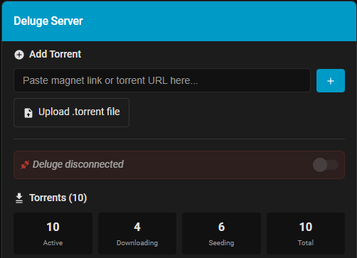

# Deluge Speed Toggle

A Home Assistant custom component that provides a simple toggle switch to quickly switch between two preset download/upload speed limits for the Deluge torrent client.

  ## ✨ Features & Overview

  - 🎚️ **Easy Toggle Switch**: One-click switching between two speed presets in the Home Assistant UI
  - ⚙️ **Customizable Presets**: Set your own download and upload speed limits for each preset
  - 📊 **Both Upload & Download Control**: Adjust both directions simultaneously
  - 🔒 **Secure**: Password-protected connection to Deluge
  - 📝 **Logging**: Comprehensive logging for troubleshooting
  - ✅ **Connection Validation**: Tests Deluge connection before saving configuration
  - 📈 **Real-time Monitoring**: Optional sensors for download/upload speeds and torrent statistics
  - 🎨 **Custom Lovelace Card**: Beautiful status card with speed control and torrent overview

  ---

  ## 🖼️ Example Card Screenshot

  
  > The card displays torrent status, speed, and connection state. In this example, Deluge is disconnected, but the card still shows torrent statistics and history.

  ---

  ## 🚀 Quick Start / Installation

  ### Method 1: HACS (Recommended)
  1. **Add Custom Repository** in HACS:
     - Go to HACS → Integrations → ⋮ (three dots) → Custom repositories
     - Add URL: `https://github.com/weasalNZ/deluge-speed-toggle`
     - Category: Integration
     - Click "Add"
  2. **Install via HACS**:
     - Search for "Deluge Speed Toggle" in HACS Integrations
     - Click "Download"
     - Restart Home Assistant
  3. **Add Integration**:
     - Go to Settings → Devices & Services
     - Click "Add Integration"
     - Search for "Deluge Speed Toggle"

  ### Method 2: Manual Installation
  **Requirements:**
  - Home Assistant (Core 2024.1.0 or later)
  - Deluge torrent client with JSON-RPC API enabled
  - Network access to Deluge from Home Assistant

  **Setup Steps:**
  1. Copy the component files to your Home Assistant `custom_components` directory:
     ```
     ~/.homeassistant/custom_components/deluge_speed_toggle/
     ├── __init__.py
     ├── config_flow.py
     ├── const.py
     ├── manifest.json
     ├── services.yaml
     ├── speed_toggle.py
     ├── switch.py
     └── README.md
     ```
  2. Restart Home Assistant to load the custom component

  ---

### Configuration Wizard

When you add the integration, you'll be prompted to enter:

#### Connection Settings
- **Host**: IP address or hostname of your Deluge server (default: `localhost`)
- **Port**: Deluge web UI port (default: `8112`)
- **Password**: Deluge web UI password (required)

#### Speed Presets
- **Preset 1 Name**: Label for the first preset (default: "Limited")
  - **Download Speed**: Download limit in KiB/s (default: `500`)
  - **Upload Speed**: Upload limit in KiB/s (default: `100`)

- **Preset 2 Name**: Label for the second preset (default: "Unlimited")
  - **Download Speed**: Download limit in KiB/s (default: `-1` for unlimited)
  - **Upload Speed**: Upload limit in KiB/s (default: `-1` for unlimited)


### Speed Units

All speeds are specified in **KiB/s** (kilobytes per second):
- Use `-1` to set unlimited speed for either direction
- Common values:
  - `100` = 100 KiB/s (≈ 0.8 Mbps)
  - `500` = 500 KiB/s (≈ 4 Mbps)
  - `1000` = 1000 KiB/s (≈ 8 Mbps)
  - `5000` = 5000 KiB/s (≈ 40 Mbps)
  - `-1` = Unlimited

  ---

  ## Installation: Custom Lovelace Card

  To install the Deluge Status custom Lovelace card in Home Assistant:

  1. **Copy the card file to your Home Assistant:**
     ```
     /config/www/hacsfiles/deluge-status-card/deluge-status-card.js
     ```
  2. **Add the resource in Home Assistant:**
     - Go to **Settings → Dashboards → Resources**
     - Add resource: `/local/hacsfiles/deluge-status-card/deluge-status-card.js` (type: JavaScript Module)
  3. **Add the card to your dashboard:**
     ```yaml
     type: custom:deluge-status-card
     entity: switch.deluge_speed_toggle
     name: "Deluge Server"
     show_speed: true
     show_torrents: true
     ```
  4. **Preview the card design** by opening `deluge-status-card-preview.html` in your browser.

  ## Card Configuration Options

  | Option         | Default         | Description                                 |
  |---------------|----------------|---------------------------------------------|
  | `entity`      | **Required**    | Your Deluge speed toggle switch entity       |
  | `name`        | "Deluge Server"| Display name in card header                  |
  | `show_title`  | true           | Show/hide the card header                   |
  | `show_speed`  | true           | Show/hide current speed section             |
  | `show_torrents`| true           | Show/hide torrent statistics                |

  ---

  ## Usage

### Using the Switch in Home Assistant UI
- Go to **Settings → Devices & Services → Entities** in Home Assistant.
- Find the **Deluge Speed Toggle** switch.
- Click the toggle to switch between your configured speed presets:
  - **OFF** = Preset 1 (Limited speeds)
  - **ON** = Preset 2 (Unlimited speeds)

### Using in Automations
You can automate speed changes with Home Assistant automations:
```yaml
automation:
  - alias: "Limit Deluge at night"
    trigger:
      platform: time
      at: "22:00:00"
    action:
      service: switch.turn_off
      entity_id: switch.deluge_speed_toggle

  - alias: "Unlimited Deluge in morning"
    trigger:
      platform: time
      at: "08:00:00"
    action:
      service: switch.turn_on
      entity_id: switch.deluge_speed_toggle
```

### Using the Service Call
You can also make direct service calls for fine-grained control:
- **Service**: `deluge_speed.set_speed`
- **Parameters**:
  - `download`: Download speed in KiB/s (`-1` for unlimited)
  - `upload`: Upload speed in KiB/s (`-1` for unlimited)
- **Example**:
```yaml
service: deluge_speed.set_speed
data:
  download: 2000
  upload: 500
```

## Troubleshooting

### Connection Failed
**Error:** "Cannot connect to Deluge" appears during setup
- Verify Deluge is running and accessible on the network
- Check the host and port settings
- Ensure the port is not blocked by a firewall
- Test with: `curl -X POST http://DELUGE_HOST:8112/json`
- Confirm the correct web UI password is used
- Make sure Deluge's JSON-RPC API is enabled

### Authentication Failed
**Error:** "Deluge authentication failed: Invalid password"
- Double-check your Deluge web UI password
- Avoid special characters that may cause issues
- Restart Deluge and try again

### Switch Not Responding
- Check Home Assistant logs for errors (Settings → System → Logs)
- Ensure Deluge is running and reachable
- Verify network connectivity between Home Assistant and Deluge
- Restart Home Assistant

### Card Not Displaying or Entity ID Issues
- Ensure the expected entity IDs exist (e.g., `switch.deluge_speed_toggle`)
- If entity IDs have numbers at the end (e.g., `sensor.deluge_download_speed_2`), recreate entity IDs in Home Assistant:
  1. Go to **Settings > Devices & Services**
  2. Find **Deluge Speed Toggle** and click the arrow next to your Deluge Server
  3. Click the three dots (⋮) in the top right corner
  4. Select **Recreate Entity IDs**
  5. Restart Home Assistant if prompted

#### Example: Entity ID Error
If your Deluge Status Card does not display correctly and you notice that entity IDs have numbers at the end (e.g., `sensor.deluge_download_speed_2`), it may look similar to the screenshot below:



This usually means the card cannot find the expected entities. See the steps above to recreate entity IDs and resolve this issue.

### Logging
Enable debug logging in `configuration.yaml` for more details:
```yaml
logger:
  logs:
    custom_components.deluge_speed: debug
```
Then check logs in Home Assistant UI: **Settings → System → Logs**

## Testing the Deluge JSON-RPC API

If you encounter connection or authentication issues, you can manually test the Deluge JSON-RPC API using curl:

**Test Connection:**
```bash
curl -X POST http://<DELUGE_HOST>:8112/json \
  -H "Content-Type: application/json" \
  -d '{
    "method": "auth.login",
    "params": ["your-password"],
    "id": 1
  }'
```

**Set Speeds Example:**
```bash
curl -X POST http://<DELUGE_HOST>:8112/json \
  -H "Content-Type: application/json" \
  -d '{
    "method": "core.set_config",
    "params": [{
      "max_download_speed": 500,
      "max_upload_speed": 100
    }],
    "id": 2
  }'
```

Replace `<DELUGE_HOST>` and `your-password` with your actual Deluge server address and password.

## Support & Links

- **Home Assistant Forum:** [Community Discussions](https://community.home-assistant.io/)
- **GitHub Issues:** [Report bugs or request features](https://github.com/weasalNZ/deluge-speed-toggle/issues)
- **Deluge Documentation:** [Official Deluge Docs](https://deluge-torrent.org/)

## License

This custom component is provided as-is for use with Home Assistant under the MIT License.

## Version History

- **1.1**: Added switch entity toggle, dual preset support, comprehensive error handling and logging
- **1.0**: Initial release with set_speed service